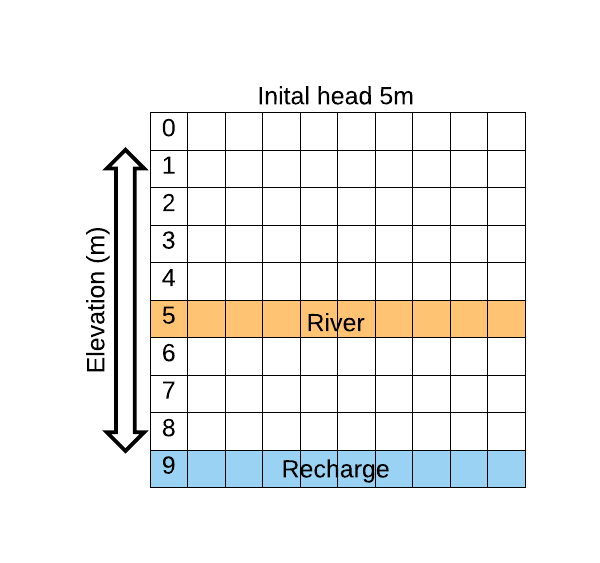

## Quick start
The following picture shows the conceptual example model:


After compilation run:
```
simple_model
```
It will yield a depth to water table CSV file called wtd.csv for a simple model.

## How to use
The follwing will guide you through the building blocks of the simple model shipped along with the code.
It assumes that you've constructed your model domain and have input data for the following
* Groundwater recharge (recharge_simple.csv)
* Surface elevation (elevation_simple.csv)
* Rivers, location, elevation and depth (rivers_simple.csv)
* Hydrogeology (lithology_simple.csv)
* Riverbed conductance (rivers_simple.csv)
* Inital head guess (otherwise the model assumes the surface elevation as best guess) ("heads_simple.csv")

Center building stone for the framework is the GW_interface connecting any model with the groundwater code.
Implement this interface if you want to couple your model to G³M-f or build a custom standalone application.
In tests/SimpleModel you'll find an example implementation explained further in the following.

```
class GW_Interface {
    public:
        virtual ~GW_Interface() {}

        virtual void
        loadSettings() = 0;

        virtual void
        setupSimulation() = 0;

        virtual void
        writeData() = 0;

        virtual void
        simulate() = 0;
};
```

The following shows the code for a simple model loop running a steady-state model with daily timesteps.
```
void StandaloneRunner::simulate() {
    Simulation::Stepper stepper = Simulation::Stepper(_eq, Simulation::DAY, 1);
    for (Simulation::step step : stepper) {
        LOG(userinfo) << "Running a steady state step";
        step.first->toogleSteadyState();
        step.first->solve();
        sim.printMassBalances();
    }
    DataProcessing::DataOutput::OutputManager("data/out_simple.json", sim).write();
    //sim.save();
}
```

### Write out data
Write out of data is specified by a JSON file called out.json.
If you want to add custom fields you can do so in src/DataProcessing/DataOutput.
```
{
  "output": {
    "StaticResult": [
      {
        "name": "wtd",
        "type": "csv",
        "field": "DepthToWaterTable",
        "ID": "false",
        "position": "true"
      }
    ],
    "InnerIteration": {
    },
    "OuterIteration": {
    }
  }
}

```

### Config model
In order to configure the model variables you can simply change the .json file. Allowing you to change the convergence criteria and the location for your input files.

### Parameters
The following explains the main config parameters.

* model_config
  * nodes: A file describing the input grid
  * row_cols: true: neighbouring is determined by their position in an evenly grid, false: neighbouring is determined by their lat and lon position (currently only supports 5' resolution)
  * threads: How many computation threads to use to solve the equation
  * layers: Number of layers of the model domain
  * confinement: Define which of the layers is a confined layer
* numerics
  * solver: Currently only Preconditioned Conjugent Gradient, code for a newton approach is available but untested
  * iterations: Number of picard iterations
  * closingcrit: Inf norm of the residuals
  * headchange: Closing criterion for max. head change for 3 consecutive iterations
  * damping: Damping of residuals in between picard iterations
* input: Internaly the model code assumes time dependant parameters to be per day
  * data_config: Describes wether default data is used or a input file should be read
  * default_data: specifiy default parameters
  * data: Inputdata - can be modified according to the users need. The shown inputs are the supported defaults

```
{
  "config": {
    "model_config": {
      "nodes": "grid_simple.csv",
      "row_cols": "true",
      "stadystate": "true",
      "numberofnodes": 100,
      "threads": 1,
      "layers": 2,
      "confinement": [
        "false",
        "true"
      ],
      "cache": "false",
      "adaptivestepsize": "false",
      "boundarycondition": "SeaLevel",
      "sensitivity": "false"
    },
    "numerics": {
      "solver": "PCG",
      "iterations": 500,
      "inner_itter": 10,
      "closingcrit": 1e-8,
      "headchange": 0.0001,
      "damping": "false",
      "min_damp": 0.01,
      "max_damp": 0.5,
      "stepsize": "daily"
    },
  "input": {
    "data_config": {
      "k_from_lith": "true",
      "k_ocean_from_file": "false",
      "specificstorage_from_file": "false",
      "specificyield_from_file": "false",
      "k_river_from_file": "true",
      "aquifer_depth_from_file": "false",
      "initial_head_from_file": "true",
      "data_as_array": "false"
    },
    "default_data": {
      "initial_head": 5,
      "K": 0.008,
      "oceanK": 800,
      "aquifer_thickness": [
        10,
        10
      ],
      "anisotropy": 10,
      "specificyield": 0.15,
      "specificstorage": 0.000015
    },
    "data": {
      "recharge": "recharge_simple.csv",
      "elevation": "elevation_simple.csv",
      "rivers": "rivers_simple.csv",
      "lithologie": "lithology_simple.csv",
      "river_conductance": "rivers_simple.csv",
      "initial_head": "heads_simple.csv"
    }
  }
  }
}
```

## Deployment in other models
The main steps towards your own model is to implement the GW_interface and provide a DataReader.
A standlone version can be easily implemented by extending the simple example provided above.

### In memory coupling
G³M-f is written with the coupling to other models in mind.
In contrast to other model coupling efforts, it is not necessary to write out files in one model and read them in in another model.
You can diretly link G³M-f with your existing executable and by providing a class in your already existing model code that implements the gw_interface, you are free to call the simulate() function at any timestep you like.
Furthermore, the interface provides pointer containers and callbacks to transfer data in memory without the need to waste time on I/O.

Please contact us if you need advice.

## Running the tests
Automated tests consits of gunit test which are compiled automatically with the attached cmake file.
You can run them by executing the test executable.

```
runUnitTests
```

## Further documentation:

[The full documentation](html_doku/index.html)


